# GlyphBench

**A playground for language-model reinforcement learning.**

GlyphBench brings popular games into a shared text interface for studying how
language models plan, remember, explore, and learn from interaction. Agents see
a two-dimensional Unicode grid, a legend, and a status display, then choose a
named action. The same environments support evaluation, reinforcement learning,
and interactive replay.

<table>
  <tr>
    <td align="center" width="33%"><strong>Classics · Snake</strong><br>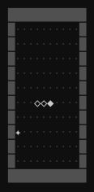</td>
    <td align="center" width="33%"><strong>MiniGrid · MultiRoom</strong><br>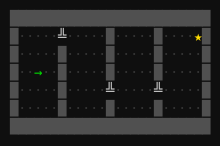</td>
    <td align="center" width="33%"><strong>MiniHack · Corridor</strong><br>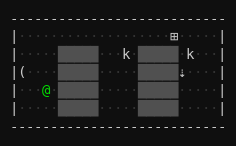</td>
  </tr>
  <tr>
    <td align="center"><strong>Craftax · ChopTrees</strong><br>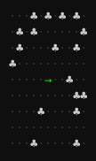</td>
    <td align="center"><strong>Miniatari · Space Invaders</strong><br>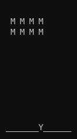</td>
    <td align="center"><strong>Procgen · CoinRun</strong><br>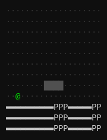</td>
  </tr>
  <tr>
    <td align="center"><strong>Atari · Breakout</strong><br>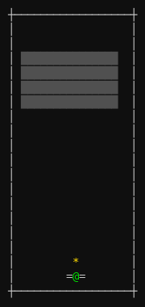</td>
    <td align="center"><strong>CraftaxFull</strong><br>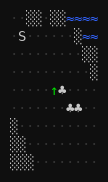</td>
    <td align="center"><strong>NetHack</strong><br>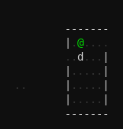</td>
  </tr>
</table>

*Sample trajectories from all nine suites, showing the grids agents receive.
The last row contains the extended games.*

[Quickstart](#quickstart) · [Environments](docs/ENVIRONMENTS.md) ·
[Evaluation](eval/README.md) · [Training](configs/rl/qwen35-4b-glyphbench/README.md) ·
[Replay](docs/REPLAY.md) · [Contributing](CONTRIBUTING.md)

## The environments

The benchmark contains **303 standard tasks across six suites**, covering
navigation, puzzles, arcade control, survival, and crafting. Standard tasks
finish in fewer than 512 environment turns and keep cumulative returns in
`[-1, 1]`. These bounds make interaction budgets predictable and keep large
reward scales from dominating a task mixture.

| Suite | Tasks | What agents do |
|---|---:|---|
| Classics | 50 | Solve puzzles and play games such as Snake, Sokoban, Minesweeper, and Sudoku. |
| MiniGrid | 71 | Navigate rooms, find keys, open doors, and remember hidden cues. |
| MiniHack | 63 | Explore dungeons, use items, fight monsters, and combine skills. |
| Craftax | 60 | Complete focused survival, crafting, combat, and progression tasks. |
| Miniatari | 43 | Play compact arcade games designed for short episodes. |
| Procgen | 16 | Navigate procedurally generated platformers, shooters, and mazes. |

An additional **59 extended tasks** retain longer games: Atari (57), CraftaxFull
(1), and NetHack (1). They are evaluated separately from the standard benchmark;
the code calls these suites *archival*. CraftaxFull and NetHack preserve their
native rewards and require optional dependencies. The
[environment catalog](docs/ENVIRONMENTS.md) lists task IDs and action counts;
optional dependencies affect which adapters are available in a local install.

The standard suites are implemented in Python and NumPy. They adapt the game
mechanics to GlyphBench's interface; the full Craftax and NetHack adapters use
the upstream games. Given the same seed and action sequence, an environment
reproduces the same trajectory.

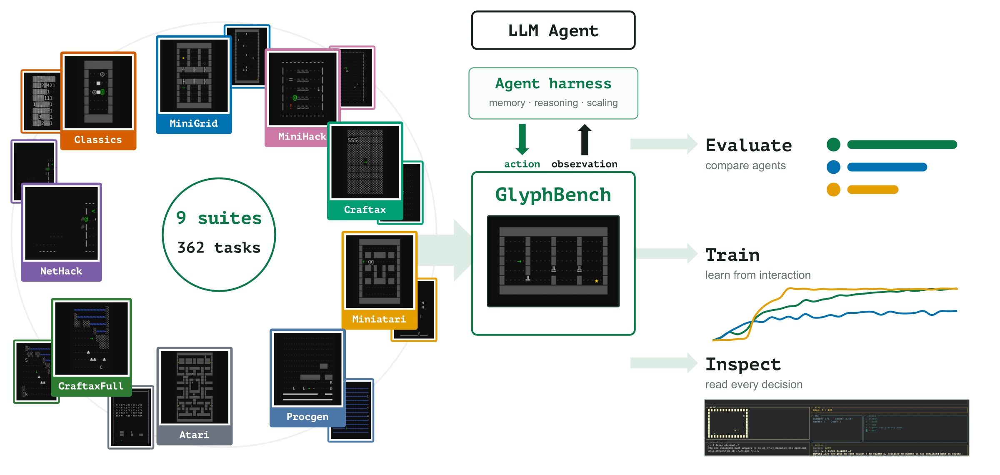

## Install

GlyphBench is available on the [Prime Environments Hub](https://app.primeintellect.ai/dashboard/environments/roger-creus/glyphbench).
Follow the Hub's installation steps to keep the Prime CLI and GlyphBench runtimes
separate and select the correct Python environment.

Use Python 3.12 and [uv](https://docs.astral.sh/uv/). From a source checkout:

```bash
git clone --recurse-submodules https://github.com/VmaxAI/glyphbench.git
cd glyphbench
uv sync
uv run glyphbench list-suites
```

Choose optional dependencies for the workflow you need:

```bash
uv sync --extra dev       # tests, linting, and type checks
uv sync --extra eval-client # Prime CLI for an existing model server
uv sync --extra eval      # Prime CLI and local vLLM serving
uv sync --extra rl        # pinned Prime-RL GPU training stack
uv sync --extra craftax   # full-game Craftax adapter
uv sync --extra nethack   # full-game NetHack adapter
```

The GPU recipes target Linux. The standard games do not need GPU inference or
the optional full-game dependencies. See the [setup guide](docs/GETTING_STARTED.md)
for development checks and local configuration.

## Quickstart

```python
from glyphbench.core import make_env

env = make_env("glyphbench/minigrid-empty-5x5-v0")
try:
    observation, info = env.reset(seed=42)
    print(observation)

    action = env.action_spec.index_of("MOVE_FORWARD")
    observation, reward, terminated, truncated, info = env.step(action)
    print(observation)
finally:
    env.close()
```

`reset` and `step` return text observations. The direct API takes integer action
indices; `action_spec.index_of` converts a name to its index. An LLM harness
presents the action vocabulary and parses replies such as
`<action>MOVE_FORWARD</action>`. See [agent integration](docs/INTEGRATION.md) for
a complete loop and the [observation format](docs/OBSERVATION_FORMAT.md) for
the prompt structure.

To load tasks through the Verifiers evaluation interface:

```python
import glyphbench

env = glyphbench.load_environment(
    include_suites=["minigrid", "minihack", "miniatari"],
    num_episodes=3,
)
```

Use `task_id` for a particular environment, `include_suites` for game families,
or `include_tasks` for patterns such as `glyphbench/*-pong-v0`. The
[evaluation scripts](eval/README.md) select the standard benchmark by default
and work with OpenAI-compatible model servers.

## Train and evaluate

GlyphBench includes single-task and multitask Qwen3.5-4B recipes for Prime-RL
v0.9. A native Verifiers v1 integration runs game turns in-process and supports
task mixtures, seeded sampling, and periodic evaluation. The
[training guide](configs/rl/qwen35-4b-glyphbench/README.md) covers config
generation, local smoke runs, Slurm, and the paper's 100-task mixture.

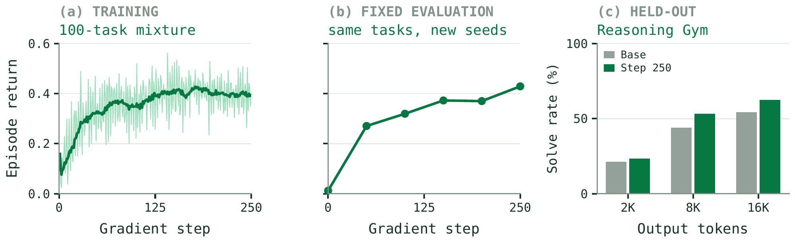

*One Qwen3.5-4B policy trained on 100 tasks. Left: training returns, with a trailing
nine-step mean. Center: evaluation on new seeds of the same tasks. Right:
Reasoning Gym solve rates before and after 250 updates, using 9,300 attempts
per model at each output-token budget. These are the paper's reported results
from one training run.*

The [Reasoning Gym evaluator](eval/reasoning_gym/README.md) provides the pinned
external reasoning panel, resumable evaluation, and paired comparisons.

## Inspect agent behavior

The replay UI places the model-facing grid next to generated reasoning, the
parsed action, reward, and optional memory. Use it to follow a route, inspect
resource use, or examine the decisions preceding a failure.

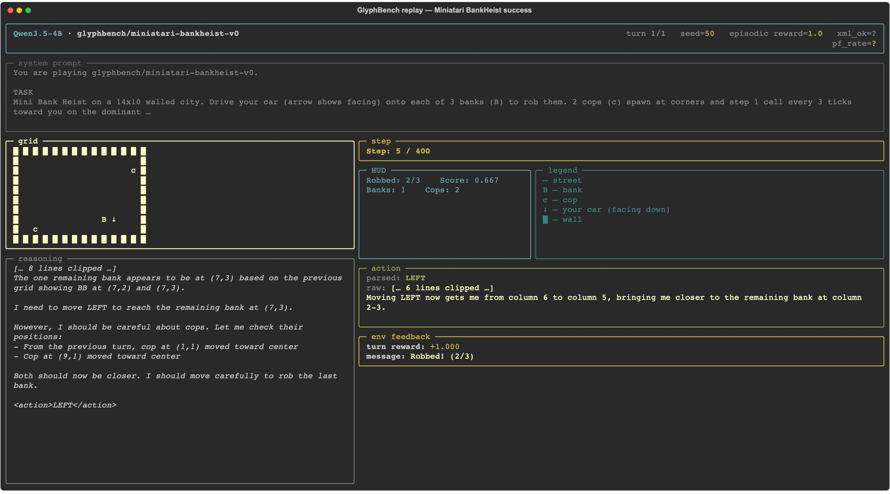

```bash
uv run glyphbench replay path/to/runs --list
uv run glyphbench replay path/to/runs --pause
```

In pause mode, use `←` and `→` to step through decisions; `s`, `r`, `m`, and `l`
open the full system prompt, reasoning, memory, and legend. The
[replay guide](docs/REPLAY.md) covers filters and diagnostic indicators.

## Documentation

- [Getting started](docs/GETTING_STARTED.md)
- [Environment catalog](docs/ENVIRONMENTS.md)
- [Observation format](docs/OBSERVATION_FORMAT.md) and [agent integration](docs/INTEGRATION.md)
- [Model evaluation](eval/README.md) and [failure diagnostics](docs/llm-agent-failure-modes.md)
- [RL training recipes](configs/rl/qwen35-4b-glyphbench/README.md)
- [Held-out Reasoning Gym evaluation](eval/reasoning_gym/README.md)
- [Trajectory replay](docs/REPLAY.md) and [utility scripts](scripts/README.md)
- [Architecture](docs/ARCHITECTURE.md) and [contributing](CONTRIBUTING.md)

## License

GlyphBench is released under the [MIT license](LICENSE). The optional games in
`third_party/` retain their own licenses.
